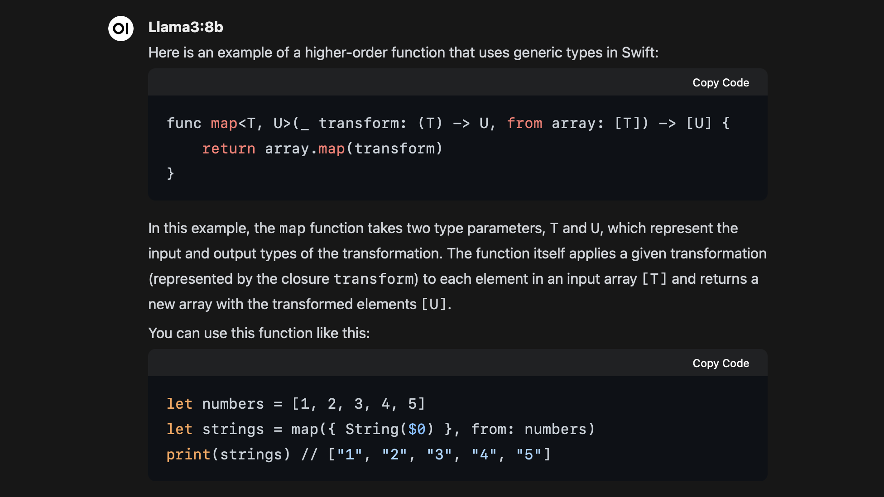

# How-to: Llama 3 on Apple Silicon

On April 18th, [Meta released](https://ai.meta.com/blog/meta-llama-3/) the Llama 3 large language model (LLM). We can leverage the machine learning capabilities of Apple Silicon to run this model and receive answers to our questions.



Example: Answer to the question "Example of a higher-order function using generic types in Swift".

## 1: Ollama setup tool

Ollama is a setup tool for downloading and running large language models. Llama 3 can be retrieved and run in macOS using Ollama.

### 1.1 Download and install Ollama

Download and run the installer for Ollama.

> [Direct download link to Ollama for macOS](https://ollama.com/download/Ollama-darwin.zip)

> Website: [ollama.com/download](https://ollama.com/download)

### 1.2 Verify installation (optional)

You can check if Ollama has been succesfully installed by running the `Terminal.app` and executing the command:

```
ollama -v
```

You will receive a valid response if Ollama is successfully installed, such as `ollama version is 0.1.32`

## 2: The Llama 3 model

Before installing Llama 3, you must decide on a choice of model version.

### 2.1 Choose a model version

Two different versions of Llama 3 are provided by Ollama:

- Meta Llama 3 8B (4.7 GB)
- Meta Llama 3 70B (40 GB)

### 2.2 Install and run the model

The model is automatically downloaded when you attempt to run it with Ollama.

Open the `Terminal.app` and execute the command corresponding to your choice of model:

#### Meta Llama 3 8B (4.7 GB)

```
ollama run llama3:8b
```

#### Meta Llama 3 70B (40 GB)

```
ollama run llama3:70b
```

## 3: Front-end chat environment (optional)

If you prefer a ChatGPT-like environment for using the model.

### 3.1 Install Docker Desktop

The environment requires Docker Desktop be installed and running.

> [Direct download link to Docker Desktop for Apple Silicon](https://desktop.docker.com/mac/main/arm64/Docker.dmg)

> Website: [docker.com/products/docker-desktop/](https://www.docker.com/products/docker-desktop/)

Run `Docker.app`.

### 3.2 Download and run the Web UI

Install the UI by opening the `Terminal.app` and executing this command:

```
docker run -d -p 3000:8080 --add-host=host.docker.internal:host-gateway -v open-webui:/app/backend/data --name open-webui --restart always ghcr.io/open-webui/open-webui:main
```

### 3.3 Open the Web UI

Open a web browser and navigate to the URL: [http://localhost:3000/](http://localhost:3000/)

```
http://localhost:3000/
```

Click on the `sign up` button and enter any details (will only be stored locally).

### 3.4 Use the model

Click on `Select a model` and choose `llama3`.

Now you can ask it questions and receive answers.